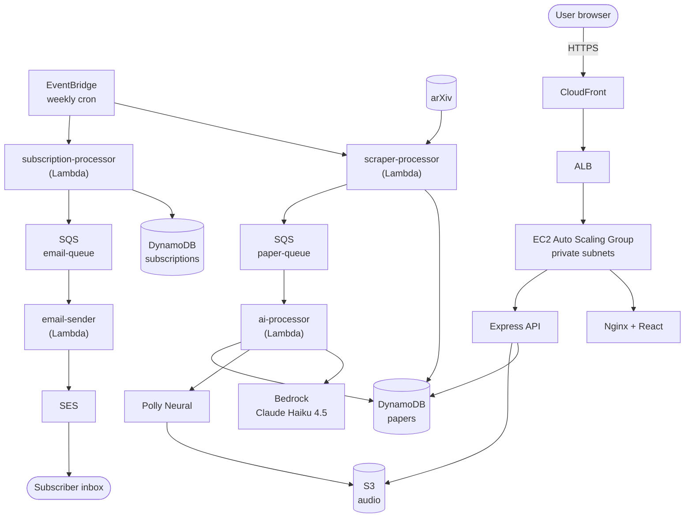
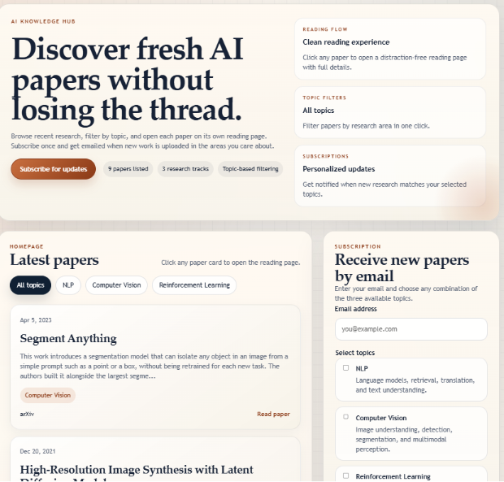
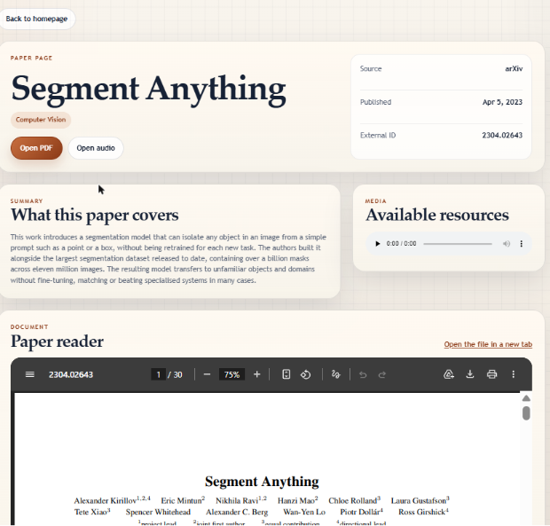

# AI Knowledge Hub

**A serverless AWS pipeline that scrapes arXiv every week, summarises each paper with Amazon Bedrock, narrates it with Amazon Polly, and emails subscribers a personalised digest.**

Built as an end-to-end cloud engineering project: an event-driven Lambda pipeline for the data work, a containerised React + Express app for the UI, and the whole thing defined in Terraform — VPC, private subnets, NAT, ALB, auto-scaling group, and CloudFront included.

<p>
  
  
  
  
  
</p>

> **Deployment status:** the stack is deploy-on-demand. It is torn down between demos because the NAT gateway and ALB cost roughly $2/day to leave idle. [`infra/REDEPLOY.md`](infra/REDEPLOY.md) brings it back up from a clean AWS account in 30–45 minutes, and [Running locally](#running-locally) needs nothing but Docker.

---

## What it does

1. **Every Monday at 06:00 UTC**, a scraper Lambda pulls the latest papers from arXiv across NLP, Computer Vision, and Reinforcement Learning.
2. Each new paper is written to DynamoDB with a **conditional put**, so re-running the scraper silently deduplicates instead of erroring.
3. New papers fan out over SQS to an **AI processor**, which calls **Bedrock (Claude Haiku 4.5)** for a 3–4 sentence summary and **Polly Neural** for an MP3 narration, stored in S3.
4. **Every Monday at 08:00 UTC**, a subscription Lambda matches recent papers to each subscriber's chosen topics and queues a digest.
5. An **email sender** Lambda presigns the audio links, renders an HTML + plaintext digest, and sends it through **SES**.
6. Meanwhile the **web app** — React behind Nginx, Express behind that — lets anyone browse and filter papers, read the AI summaries, play the audio, and subscribe.

## Architecture



Both SQS queues have dead-letter queues attached, and the email sender reports **partial batch failures** so a single bad record doesn't force the whole batch to retry.

## Screenshots

Captured from the app running locally against the bundled mock API — see
[Running locally](#running-locally) to reproduce them in two commands.

**Homepage** — topic filters, paper cards with the generated summaries, and the subscription panel.



**Paper page** — metadata, the plain-language summary, the audio narration player, and the PDF inline.



## Tech stack

| Layer | Choice | Notes |
|---|---|---|
| Infrastructure | Terraform | ~60 resources across 15 `.tf` files |
| Compute (pipeline) | AWS Lambda × 4 | Node.js 18, event-driven via EventBridge + SQS |
| Compute (app) | EC2 Auto Scaling Group | Docker containers pulled from ECR on boot |
| AI | Amazon Bedrock — Claude Haiku 4.5 | Cross-region inference profile |
| Text-to-speech | Amazon Polly Neural | MP3 per paper, stored in S3 |
| Data | DynamoDB | `papers` + `subscriptions` tables |
| Storage | S3 | Versioned audio bucket, 30-day lifecycle on old versions |
| Messaging | SQS (+ DLQs) | Decouples scraping from AI processing |
| Email | SES | HTML + plaintext digests, presigned audio links |
| Edge | CloudFront → ALB | HTTPS without needing a custom domain |
| Frontend | React 19 + Vite, served by Nginx | Client-side router, no framework |
| Backend | Express 5 | REST API, graceful SIGTERM shutdown |

## Repository layout

```
backend/          Express API — papers + subscriptions, DynamoDB and S3 presigning
frontend/         React 19 + Vite SPA, served by Nginx which proxies /api to the backend
infra/            Terraform for the whole stack
  ├─ *.tf         VPC, DynamoDB, SQS, S3, IAM, Lambdas, EventBridge, ECR, EC2/ALB, CloudFront
  ├─ lambda/      The four pipeline functions + shared DynamoDB helpers
  ├─ scripts/     One-off data migration and local-testing scripts
  └─ build.sh     Packages each Lambda into infra/builds/*.zip
docs/             Design documents
```

## API

The frontend calls these through Nginx at `/api/*`, which strips the prefix before proxying.

| Method | Path | Description |
|---|---|---|
| `GET` | `/health` | Liveness probe for the ALB target group — does no database work |
| `GET` | `/papers?topic=NLP,Computer%20Vision&limit=10` | List papers, optionally filtered by comma-separated topics |
| `GET` | `/papers/:id` | Single paper, including AI summary and a presigned audio URL |
| `POST` | `/subscriptions` | Subscribe — body: `{ "email": "...", "subscribedTopics": ["NLP"] }` |

## Running locally

### Without an AWS account

`frontend/mock-api.mjs` is a dependency-free stand-in for the backend that serves
the same response shapes from a fixed set of real arXiv papers. It's what the
screenshots above were taken against.

```bash
git clone https://github.com/MK0B3/Cloud-AKH.git
cd Cloud-AKH/frontend
npm install

npm run mock       # mock API on :3001
npm run dev:mock   # Vite on :5173, pointed at the mock
```

Open <http://localhost:5173>. Browsing, filtering, the paper pages, the audio
player, and the subscribe form all work; nothing touches AWS.

### Against real AWS resources

```bash
cp backend/.env.example backend/.env   # region, table names, bucket
docker compose up --build
```

Then open <http://localhost> — frontend on port 80, backend on 3000. The backend
reads DynamoDB and S3 directly, so it needs credentials with read access to those
tables, either exported into the container environment or mounted from `~/.aws`.
Without them the API starts and `/health` responds, but paper queries fail.

The AI pipeline itself is Lambda-only and has no local equivalent — it needs a
deployed stack.

## Deploying to AWS

Full instructions live in the infra docs rather than being duplicated here:

- **[`infra/readme.md`](infra/readme.md)** — architecture, what each Terraform file provisions, what each Lambda does, deploy and teardown commands
- **[`infra/REDEPLOY.md`](infra/REDEPLOY.md)** — step-by-step rebuild from a clean AWS account, with the failure modes worth knowing about
- **[`docs/aws-deployment-walkthrough.pdf`](docs/aws-deployment-walkthrough.pdf)** — the original manual console walkthrough this Terraform replaced, written up with the reasoning behind each networking decision

Short version:

```bash
cd infra
./build.sh                                      # package the Lambdas
cp terraform.tfvars.example terraform.tfvars    # set your SES sender address
terraform init && terraform apply
# then push the container images to ECR and refresh the ASG — see REDEPLOY.md steps 7–8
```

## Engineering decisions worth calling out

**EC2 instances sit in private subnets.** Nothing in the compute tier has a public IP. Inbound traffic reaches it only through the ALB, and outbound traffic leaves through a NAT gateway. Administrative access is via SSM Session Manager, so there is no SSH port open anywhere and no key pair to leak.

**AWS traffic uses VPC endpoints, not the NAT.** SQS, SES, Bedrock, and ECR go through interface endpoints; S3 and DynamoDB through gateway endpoints. That keeps service traffic on the AWS backbone instead of routing it out to the internet and back, which is both faster and cheaper.

**Scraping is idempotent.** New papers are inserted with a conditional put on `externalId`. Re-running the scraper — manually, or after a retry — is a no-op for anything already stored, so there is no dedup pass to maintain.

**Scraping and summarising are decoupled by SQS.** arXiv responds in seconds; Bedrock and Polly take minutes for a full batch. Splitting them across a queue means the scraper isn't holding a Lambda open waiting on inference, and a Bedrock hiccup can't lose scraped data.

**The email sender reports partial batch failures.** It returns `batchItemFailures` so SQS only redelivers the records that actually failed, rather than replaying an entire batch and re-sending emails that already went out.

**The S3 bucket name embeds the account ID.** S3's namespace is global, so a fixed bucket name would collide the moment a second person deployed the stack. Interpolating the caller's account ID means the same Terraform applies cleanly in any account.

## Known limitations

Tracked honestly in **[`infra/NOTES.md`](infra/NOTES.md)** — the short list:

- **SES is in sandbox mode**, so digests only reach email addresses verified in the AWS console. Lifting this needs a support request, not a code change.
- **No automated tests.** The most valuable one would be a parser test for the arXiv Atom feed, which would catch upstream format changes before they reach production.
- **No alarms on the dead-letter queues.** The DLQs exist and catch failures, but nothing pages when messages land in them.
- **Presigned audio links expire after 7 days** — SigV4's maximum. Opening an older digest gives you a broken audio link.
- **`ai-processor` has no backoff on Bedrock throttling**, so a throttled call fails its whole batch instead of retrying with jitter.

## License

MIT — see [LICENSE](LICENSE).
